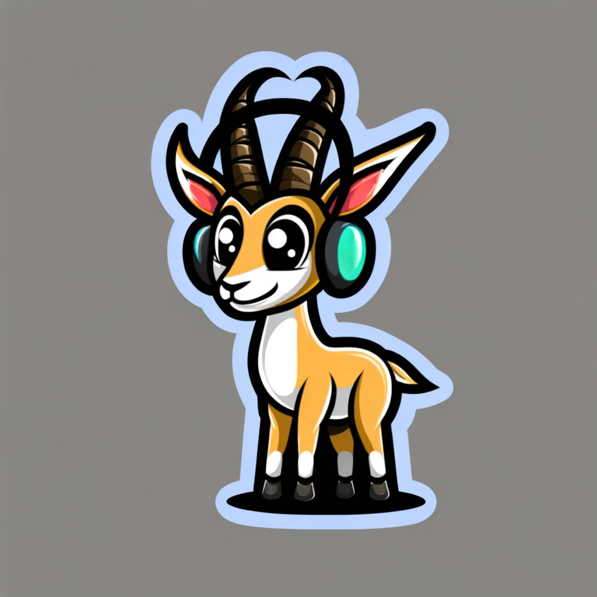

# Gazelle - Joint Speech Language Model

This repository contains modeling code for the Gazelle Joint Speech Language Model. 

For some more details, read our [blog post](https://tincans.ai/slm) or [update](https://tincans.ai/slm2).

This inference code is heavily derived from [Huggingface's Llava implementation](https://github.com/huggingface/transformers/blob/f7ef7cec6c6c162087421f36a17eabdbb223579d/src/transformers/models/llava/modeling_llava.py). It is not particularly optimized, but we welcome community contributions.

**Checkpoints**:

- v0.2: [huggingface](https://huggingface.co/tincans-ai/gazelle-v0.2)
- v0.2-dpo: [huggingface](https://huggingface.co/tincans-ai/gazelle-v0.2-dpo)
- v0.1: [huggingface](https://huggingface.co/tincans-ai/gazelle-v0.1)

**Links**:

- Join us in [Discord](https://discord.gg/qyC5h3FSzU).
- Original [blog post](https://tincans.ai/slm)
- v0.1 [release notes](https://tincans.ai/slm2)

## Disclaimer

We are backproppin' on a budget and these initial checkpoints are not very robust to many real-world considerations. We make no representation of warranty or liability.

The v0.2 model responds to jailbreaks and adversarial attacks. We do not suggest using this in production.

## License

This modeling code is licensed under Apache 2.0. The v0.2 release is derived from Mistral 7B and is released under the same Apache 2.0 license.

The v0.1 pretrained checkpoints derive from Llama 2, which is governed by the [Llama 2 license](https://ai.meta.com/llama/license/). You must agree to these terms if you use the pretrained weights!

